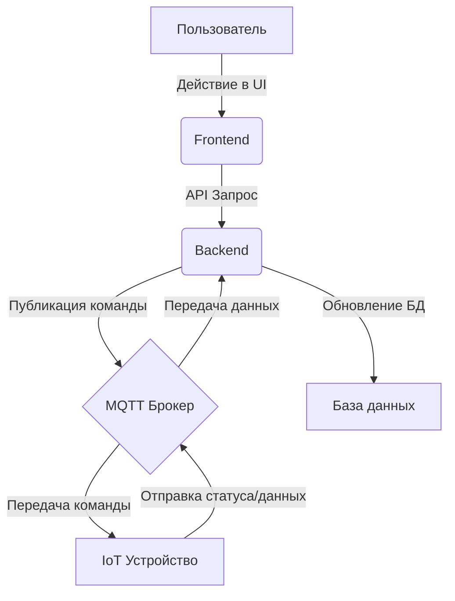

# Проект Yandex: Управление Умным Домом

-----

## Обзор Проекта

Этот проект представляет собой систему для **управления устройствами умного дома**.

Основные возможности:

  * **Идентификация устройств**: Каждое устройство уникально определяется своим **серийным номером**.
  * **Авторизация пользователей**: Пользователи могут входить в систему через **Яндекс.ID**. Их профили включают аватар, имя, адрес электронной почты и пароль.
  * **Управление устройствами**: Пользователи могут **добавлять новые устройства** по серийному номеру и присваивать им **кастомные имена**.
  * **Просмотр и детализация**: Все добавленные устройства отображаются в **таблице** на странице `/items`. Подробную информацию о каждом устройстве можно посмотреть на странице `/items/{itemId}`.

-----

## Архитектура Проекта

Проект состоит из двух ключевых компонентов: **фронтенда** и **бэкенда**.

### Фронтенд

Фронтенд отвечает за **графический веб-интерфейс** и взаимодействие с пользователем.

  * **Страницы**: Реализация страниц находится по ссылке: [https://github.com/worker-one/yandex-project/tree/develop/frontend/src/pages](https://github.com/worker-one/yandex-project/tree/develop/frontend/src/pages).
  * **Компоненты**: Отдельные компоненты, из которых строятся страницы, реализованы здесь: [https://github.com/worker-one/yandex-project/tree/develop/frontend/src/components](https://github.com/worker-one/yandex-project/tree/develop/frontend/src/components).
  * **Взаимодействие с данными**: Доступ к базе данных осуществляется исключительно через **API**, предоставляемое бэкендом.

### Бэкенд

Бэкенд обеспечивает **взаимодействие с базой данных** через **API**, управляя авторизацией пользователей и ресурсами умного дома.

-----

## MQTT Сервис

### Обзор

Для взаимодействия с устройствами в реальном времени используется MQTT-брокер. Это позволяет отправлять команды на устройства и получать от них информацию о состоянии, ошибках и другие данные.

### Архитектура MQTT



### Структура топиков

Взаимодействие с устройствами происходит через структурированные MQTT-топики. Основной формат топика:

`{user_id}/{device_id}/{topic_type}`

-   `user_id`: Идентификатор пользователя.
-   `device_id`: Идентификатор устройства.
-   `topic_type`: Тип сообщения (command, info, warning, error).

**Пример:** `123/456/command`

### Типы топиков и их назначение

| Тип топика | Направление | Описание | Пример Payload |
| :--- | :--- | :--- | :--- |
| `command` | Backend -> Устройство | Отправка команд на устройство (включить/выключить). | `{"command": "open"}` или `{"command": "close"}` |
| `info` | Устройство -> Backend | Получение информации от устройства (статус, уровень заряда). | `{"status": "online", "battery_level": 85}` |
| `warning` | Устройство -> Backend | Получение предупреждений (низкий заряд батареи). | `{"warning": "low_battery"}` |
| `error` | Устройство -> Backend | Получение сообщений об ошибках (застревание мотора). | `{"error": "motor_stuck"}` |

### Использование

1.  **Отправка команд**:
    -   Бэкенд публикует сообщение в топик `user_id/device_id/command` когда пользователь выполняет действие в интерфейсе.
2.  **Получение данных**:
    -   Бэкенд подписан на топики `user_id/+/info`, `user_id/+/warning`, `user_id/+/error` для получения данных от всех устройств.
    -   Полученные данные обрабатываются и сохраняются в базу данных.

### Настройка

MQTT-брокер (Mosquitto) настраивается в файле `docker-compose.yml`. Для аутентификации используется файл с паролями, который необходимо создать.

**Создание файла паролей:**

Выполните следующую команду, чтобы создать файл `password.txt` и добавить пользователя:

```bash
touch mqtt/config/password.txt
docker-compose run --rm mqtt mosquitto_passwd -b /mosquitto/config/password.txt <username> <password>
```

Замените `<username>` и `<password>` на ваши учетные данные, указанные в `.env` файле (`MQTT_USERNAME`, `MQTT_PASSWORD`).

-----

## Используемые Технологии (Стек)

### Бэкенд

  * ⚡ **FastAPI**: Основной фреймворк для создания API на Python.
      * **SQLAlchemy**: ORM (Object-Relational Mapper) для удобного взаимодействия с базой данных.
      * **Pydantic**: Используется для валидации данных и управления конфигурацией.
      * **PostgreSQL**: Реляционная база данных для хранения информации.

### Фронтенд

  * 🚀 **React**: Библиотека JavaScript для построения пользовательских интерфейсов.
      * **Material UI**: Набор React-компонентов, реализующих Material Design.
      * **Nginx**: Используется для обслуживания статических файлов фронтенда.

-----

## Деплой Проекта

Для развертывания сервисов проекта используется **Docker Compose**.

### 1\. Конфигурация переменных окружения

  * Переименуйте файл `.env.example` в `.env`.
  * Установите необходимые значения переменных окружения в файле `.env`.

### 2\. Запуск сервиса

Для создания и запуска образов Docker для всех сервисов проекта выполните команду:

```bash
docker-compose up -d
```

После выполнения этой команды сервис будет доступен по адресу: `http://{SERVER_HOST}`.

### 3\. Остановка сервиса

Чтобы остановить все сервисы, используйте команду:

```bash
docker-compose down
```

### 4\. Модификация и пересборка

Если вы внесли изменения в исходный код (как фронтенда, так и бэкенда), необходимо пересобрать соответствующий образ:

  * Для бэкенда:
    ```bash
    docker-compose build backend --no-cache
    ```
  * Для фронтенда:
    ```bash
    docker-compose build frontend --no-cache
    ```

После пересборки не забудьте перезапустить сервисы:

```bash
docker-compose up -d
```
